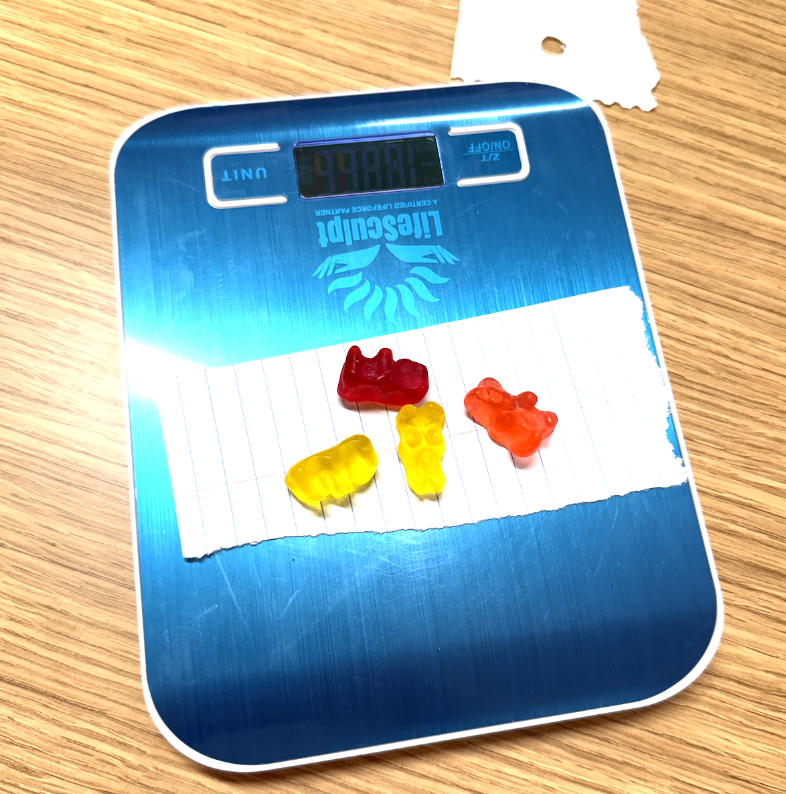
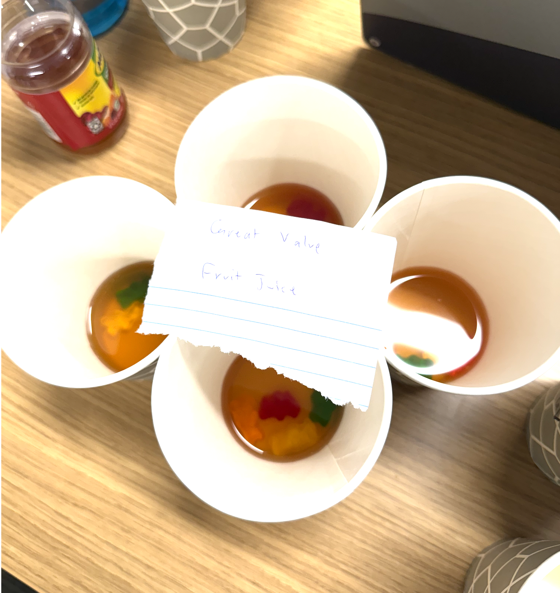
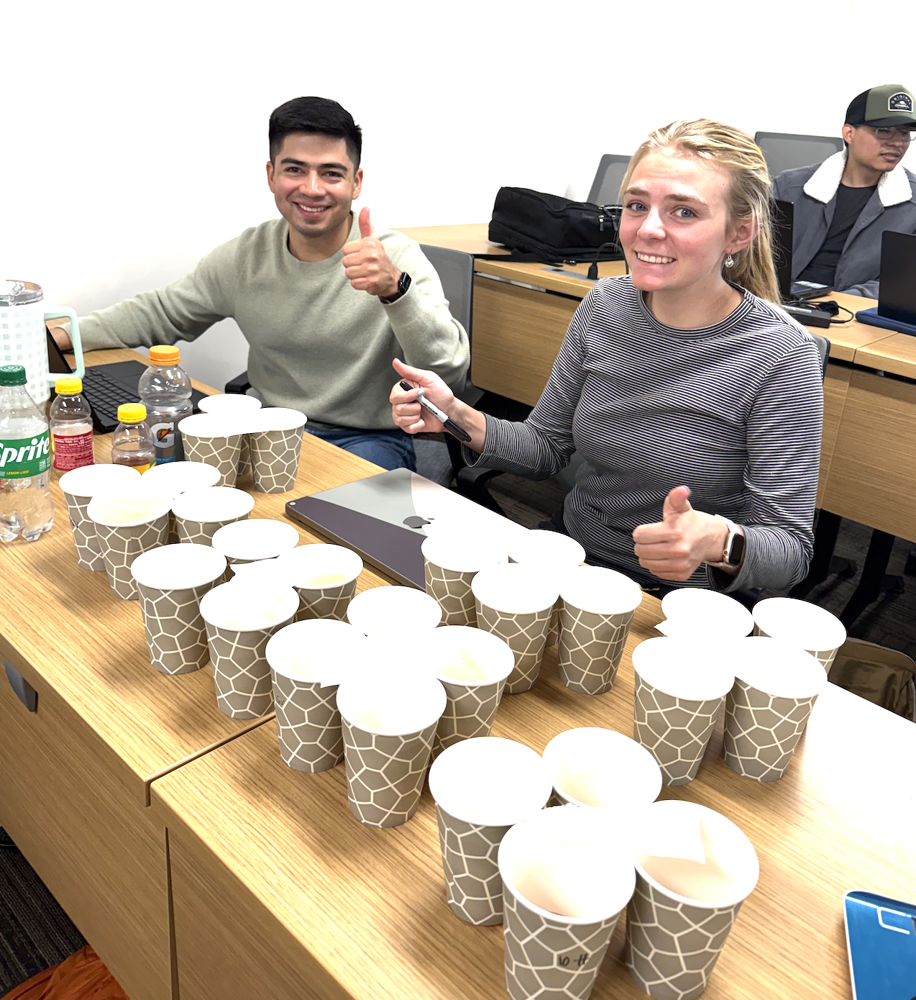
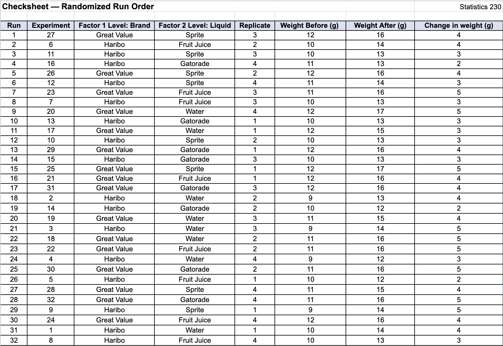

```{r}
#| label: load-packages
#| include: false
library(tidyverse)
library(kableExtra)
```

## Introduction

This experiment investigates how liquid type and gummy bear brand affect osmotic absorption, measured by weight gain after soaking. Gummy bears are composed of water, sugar, glucose syrup, starch, flavoring, food coloring, citric acid, and gelatin, making them effective tools for studying osmosis. Osmosis is the movement of water through a semipermeable membrane from a region of low solute concentration to a region of high solute concentration. Because different beverages vary in sugar and mineral content, and because different gummy bear brands differ in gelatin density and ingredient ratios, we expect both liquid type and brand to influence how much liquid each bear absorbs.

We place gummy bears into cups of four different liquids: water (control), fruit juice, Sprite, and Gatorade, and measure weight gain in grams after one hour of soaking. We predict that water will produce the highest absorption for both brands, since water has the lowest solute concentration, creating the largest osmotic gradient. We also predict that Great Value gummy bears will absorb more liquid than Haribo bears regardless of liquid type, because Haribo bears have a thicker outer gelatin layer that may resist absorption.

## Design and Data Collection

This is a two-factor completely randomized design (CRD) with interaction. The response variable is the weight gained by a group of 4 gummy bears after soaking for one hour (grams). The two factors are Brand (Haribo, Great Value) and Liquid (Water, Fruit Juice, Sprite, Gatorade). The experimental unit is a cup of 4 gummy bears. We weigh 4 gummy bears together per experimental run to reduce measurement variability from individual bear differences.

There are $2 \times 4 = 8$ treatment combinations with 4 replicates each, for a total of 32 experimental runs. Each group of 4 gummy bears was weighed before soaking and again after one hour. The response is the difference: weight after minus weight before. Randomization was implemented by generating a random permutation of all 32 runs using R, and gummy bears were soaked in the order specified by the randomized run list. All soaking was done simultaneously in separate cups to ensure each group soaked for exactly one hour.

### Statistical Model

$$y_{ijk} = \mu + \alpha_i + \beta_j + (\alpha\beta)_{ij} + \epsilon_{ijk}$$

where:

-   $y_{ijk}$ is the weight gained (g) by a cup of 4 gummy bears of brand $i$ soaked in liquid $j$, of replicate $k$
-   $\mu$ is the grand mean weight gain across all treatments
-   $\alpha_i$ is the effect of brand $i$ (Haribo, Great Value)
-   $\beta_j$ is the effect of liquid type $j$ (Water, Fruit Juice, Sprite, Gatorade)
-   $(\alpha\beta)_{ij}$ is the interaction effect between gummy bear brand $i$ and liquid type $j$
-   $\epsilon_{ijk}$ is the random error for replicate $k$ of brand $i$ soaked in liquid $j$, where $k = 1, 2, 3, 4$
-   $i = 1, 2$ indexes the brand of gummy bears (Haribo, Great Value)
-   $j = 1, 2, 3, 4$ indexes the liquid type (Water, Fruit Juice, Sprite, Gatorade)
-   $k = 1, 2, 3, 4$ indexes the replicate cup within each brand-liquid combination
-   $\epsilon_{ijk} \overset{\text{iid}}{\sim} N(0, \sigma^2)$

### Hypotheses

**Brand effect:**

$H_0: \sum \alpha_i^2 = 0$ (no effect of gummy bear brand on weight gain)

$H_A: \sum \alpha_i^2 > 0$ (there is an effect of brand on weight gain)

**Liquid effect:**

$H_0: \sum \beta_j^2 = 0$ (no effect of liquid type on weight gain)

$H_A: \sum \beta_j^2 > 0$ (there is an effect of liquid type on weight gain)

**Interaction effect:**

$H_0: \sum \sum (\alpha\beta)_{ij}^2 = 0$ (no interaction between gummy bear brand and liquid type)

$H_A: \sum \sum (\alpha\beta)_{ij}^2 > 0$ (there is an interaction between gummy bear brand and liquid type)

### Power Analysis

```{r}
#| label: power-analysis
#| echo: false
#| results: hide

# Power analysis for the two-factor design
# with between-group variance of 1 and within-group SD of approximately 1g based on pilot weighing
power.anova.test(groups = 8, n = 4, between.var = 1, within.var = 1, sig.level = 0.05)
```

We conducted a power analysis assuming 8 treatment groups with 4 replicates per group, a between-group variance of 1, and a within-group variance of 1. During pilot weighing, we observed that gummy bear weights within the same brand varied by approximately 1 gram, so we used this as our estimate of within-group variance. We estimated a similar magnitude for between-group variance based on expected differences in absorption across liquids. At a significance level of 0.05, the resulting power is 0.94. This means we have a 94% probability of detecting a real difference among treatment groups if one exists. Our sample size of 32 is sufficient for this experiment.

### Data Collection Procedure

1.  Select 64 Haribo and 64 Great Value gummy bears.
2.  For each experimental run, weigh a group of 4 gummy bears together on a digital scale (to the nearest gram) and record as Weight Before.
3.  Prepare 32 cups, each filled with 1.5 oz of the assigned liquid.
4.  Following the randomized run order from the check sheet, place each group of 4 bears into its assigned cup.
5.  Start a timer for one hour.
6.  After one hour, remove the group of 4 bears, gently pat dry with a paper towel, and weigh together again. Record as Weight After.
7.  Calculate the response: Weight After $-$ Weight Before.

**Data Collection Photos**

```{r}
#| echo: false
#| label: fig-setup
#| fig-cap: "Experimental setup showing gummy bears prepped for soaking."
#| out-width: "209px"


```

```{r}
#| echo: false
#| label: fig-cups
#| fig-cap: "Gummy bears placed in labeled cups with assigned liquids."
#| out-width: "222px"


```

```{r}
#| echo: false
#| label: fig-group
#| fig-cap: "Group members conducting the experiment together."
#| out-width: "213px"


```

## Data Analysis

```{r}
#| echo: false

gummy <- read_delim("Experiment,Brand,Liquid,Replicate,WeightBefore,WeightAfter,Response
1,Haribo,Water,1,10,14,4
2,Haribo,Water,2,9,13,4
3,Haribo,Water,3,9,14,5
4,Haribo,Water,4,9,12,3
5,Haribo,Fruit Juice,1,10,12,2
6,Haribo,Fruit Juice,2,10,14,4
7,Haribo,Fruit Juice,3,10,13,3
8,Haribo,Fruit Juice,4,10,13,3
9,Haribo,Sprite,1,9,14,5
10,Haribo,Sprite,2,10,13,3
11,Haribo,Sprite,3,10,13,3
12,Haribo,Sprite,4,11,14,3
13,Haribo,Gatorade,1,10,13,3
14,Haribo,Gatorade,2,10,13,3
15,Haribo,Gatorade,3,10,12,2
16,Haribo,Gatorade,4,11,13,2
17,Great Value,Water,1,12,15,3
18,Great Value,Water,2,11,16,5
19,Great Value,Water,3,11,15,4
20,Great Value,Water,4,12,17,5
21,Great Value,Fruit Juice,1,12,16,4
22,Great Value,Fruit Juice,2,11,16,5
23,Great Value,Fruit Juice,3,11,16,5
24,Great Value,Fruit Juice,4,12,16,4
25,Great Value,Sprite,1,12,17,5
26,Great Value,Sprite,2,12,16,4
27,Great Value,Sprite,3,12,16,4
28,Great Value,Sprite,4,11,15,4
29,Great Value,Gatorade,1,12,16,4
30,Great Value,Gatorade,2,11,16,5
31,Great Value,Gatorade,3,12,16,4
32,Great Value,Gatorade,4,11,16,5",
delim = ",", col_names = TRUE, show_col_types = FALSE)

gummy <- gummy |>
  mutate(Brand = factor(Brand),
         Liquid = factor(Liquid))
```

The data set contains 32 observations and 7 variables. The variable names are Experiment, Brand, Liquid, Replicate, WeightBefore, WeightAfter, and Response. Brand and Liquid are character variables converted to factors, while Experiment, Replicate, WeightBefore, WeightAfter, and Response are numeric. The variable names and types match expectations.

### Summary Statistics

```{r}
#| echo: false
#| label: tbl-summstats
#| tbl-cap: "Summary statistics of weight gained (g) by brand and liquid type."
#| warning: false

gummy |>
  group_by(Brand, Liquid) |>
  summarize(n = n(),
            Mean = round(mean(Response, na.rm = TRUE), 4),
            SD = round(sd(Response, na.rm = TRUE), 4),
            .groups = "drop") |>
  kable() |>
  kable_styling(bootstrap_options = c("striped", "hover"))
```

As shown in @tbl-summstats, Great Value gummy bears gained more weight on average than Haribo bears across all liquid types. The highest mean weight gain was 4.50 grams for Great Value in both Fruit Juice and Gatorade. The lowest mean weight gain was 2.50 grams for Haribo in Gatorade. Among Haribo bears, water produced the highest mean absorption (4.00 g), while Gatorade produced the lowest (2.50 g). Among Great Value bears, the means were relatively similar across all four liquids (ranging from 4.25 to 4.50 g). The standard deviations ranged from 0.50 (Great Value-Sprite) to 1.00 (Haribo-Sprite). The ratio of the largest to smallest SD across all 8 treatment groups is 1.00 / 0.50 = 2.00, which is right at the threshold of 2, suggesting the constant variance assumption is approximately met.

```{r}
#| echo: false
#| results: false

# Ratio of SDs for constant variance check
sd_ratio <- gummy |>
  group_by(Brand, Liquid) |>
  summarize(SD = sd(Response, na.rm = TRUE), .groups = "drop") |>
  summarize(ratio = max(SD) / min(SD)) |>
  pull(ratio)

cat("Ratio of largest to smallest SD:", round(sd_ratio, 2))
```

### Two-Way ANOVA

```{r}
#| echo: false
#| label: tbl-anova
#| tbl-cap: "Two-way ANOVA table for weight gained (g) by brand and liquid type."

model <- aov(Response ~ Brand * Liquid, data = gummy)
anova(model) |> kable(digits = 4) |> kable_styling(bootstrap_options = c("striped", "hover"))
```

As shown in @tbl-anova, we reject $H_0$ for the effect of Brand ($F = 18.00$, $p = 0.0003$), since the p-value is less than 0.05, indicating that the true mean weight gain differs between Haribo and Great Value gummy bears. Great Value bears gained significantly more weight on average (4.38 g) than Haribo bears (3.25 g).

We fail to reject $H_0$ for the effect of Liquid ($F = 0.96$, $p = 0.4263$), since the p-value is greater than 0.05, indicating that there is not sufficient evidence of a difference in true mean weight gain across the four liquid types.

We fail to reject $H_0$ for the Brand:Liquid interaction ($F = 2.15$, $p = 0.1206$), since the p-value is greater than 0.05, indicating that there is not sufficient evidence that the effect of liquid type on weight gain depends on brand.

Since only Brand is significant and it has just two levels, pairwise comparisons are not needed. The ANOVA test already tells us that Great Value absorbs more than Haribo.

### Main Effects Plot

```{r}
#| echo: false
#| label: fig-maineffects
#| fig-cap: "Main effects plot showing mean weight gained (g) by brand (left) and interaction plot showing mean weight gained by liquid type for each brand (right)."

# Main effects plot for Brand
brand_means <- gummy |> group_by(Brand) |> summarize(mean = mean(Response))

plot(as.numeric(brand_means$Brand), brand_means$mean,
     type = "b", pch = 16, cex = 1.5,
     xaxt = "n",
     xlab = "Brand", ylab = "Mean Weight Gained (g)",
     main = "Main Effects: Brand",
     ylim = c(0, 6))
axis(1, at = 1:2, labels = brand_means$Brand)
```

As shown in @fig-maineffects, Great Value gummy bears absorbed more weight on average (approximately 4.38 g) compared to Haribo gummy bears (approximately 3.25 g). Since the interaction between Brand and Liquid was not statistically significant, we focus on the main effect of Brand, which was significant. This suggests that regardless of which liquid is used, Great Value gummy bears tend to absorb more weight than Haribo gummy bears.

### Assumption Checks

```{r}
#| echo: false
#| fig-show: hide

resids <- resid(model)

# Index plot of residuals
plot(resids, type = "b", main = "Index Plot of Residuals",
     ylab = "Residuals", xlab = "Index")
abline(h = 0)

# QQ plot
qqnorm(resids, main = "Normal Q-Q Plot of Residuals")
qqline(resids)
```

```{r}
#| echo: false
#| results: false

# Mean and SD of residuals
cat("Mean of residuals:", round(mean(resids), 6), "\n")
cat("SD of residuals:", round(sd(resids), 4), "\n")
```

**Mean:** The mean of the residuals is 0.

**Equal Variance:** The equal variance assumption is right at the threshold, as the largest SD divided by the smallest SD is exactly 2 (1.00 / 0.50 = 2.00).

**Independence:** The index plot of residuals shows dots bouncing evenly around the zero line with no discernible pattern or long streaks on one side, suggesting the independence assumption is met.

**Normality:** The QQ plot shows a staircase pattern due to the discrete nature of the response variable (whole-number weight gains), but the points generally follow the reference line without severe departures at the tails, suggesting the normality assumption is reasonably met.

In conclusion, all assumptions are approximately met, though the equal variance assumption is borderline.

### Confidence Intervals

```{r}
#| echo: false
#| label: tbl-ci
#| tbl-cap: "95% Confidence Intervals for mean weight gained (g) by brand and liquid type."
#| message: false
#| warning: false

gummy |>
  group_by(Brand, Liquid) |>
  summarize(
    Mean = mean(Response, na.rm = TRUE),
    SE = sd(Response, na.rm = TRUE) / sqrt(n()),
    Lower_CI = Mean - qt(0.975, n() - 1) * SE,
    Upper_CI = Mean + qt(0.975, n() - 1) * SE,
    .groups = "drop"
  ) |>
  mutate(across(where(is.numeric), ~ round(.x, 2))) |>
  rename(
    `Standard Error` = SE,
    `Lower 95% CI` = Lower_CI,
    `Upper 95% CI` = Upper_CI
  ) |>
  kable(align = c("l", "l", "c", "c", "c", "c")) |>
  kable_styling(
    bootstrap_options = c("striped", "hover", "condensed"),
    full_width = FALSE,
    position = "center"
  )
```

As shown in @tbl-ci, the 95% confidence intervals for the true mean weight gained are summarized for each of the eight treatment groups.

## Conclusions

Great Value gummy bears absorbed significantly more liquid than Haribo bears, as we reject $H_0$ for Brand ($F = 18.00$, $p = 0.0003$), with a mean weight gain of 4.38 g compared to 3.25 g. However, liquid type did not have a significant effect on absorption, as we fail to reject $H_0$ for Liquid ($F = 0.96$, $p = 0.4263$), and there was no significant interaction between brand and liquid type ($F = 2.15$, $p = 0.1206$). Our hypothesis that water would produce the highest absorption was not supported. Our hypothesis that Great Value would absorb more than Haribo was supported.

Since treatments were randomly assigned to gummy bears, we can make causal claims: the brand of gummy bear causes a difference in osmotic absorption. However, the gummy bears were not randomly sampled from multiple bags as they were selected from one big bag purchased at a single store, so results may not generalize to all Haribo or Great Value gummy bears. Even so, the consistent pattern across all four liquids suggests the brand difference is robust.

Future studies could increase the soaking time beyond one hour, test additional brands, or measure absorption at multiple time points to understand the rate of osmosis. Increasing the sample size beyond 4 replicates per group would also improve power for detecting liquid effects, which may exist but were too small to detect with our current design.

## Appendix

### Code

The following code includes all chunks used in this analysis, with comments added for clarity. Data are embedded directly in the `read_delim` command.

```{r ref.label=knitr::all_labels(), echo=TRUE, eval=FALSE}
```

### Check Sheet

The check sheet shown in @fig-checkSheet below was used during data collection to record the randomized run order, assigned treatments, and weight measurements for each experimental unit.

```{r}
#| echo: false
#| label: fig-checkSheet
#| fig-cap: "Check Sheet used for data collection."


```

### GenAI Feedback

We submitted our full project report and the course rubric to Claude (Anthropic) and requested an evaluation of our report against the rubric, along with suggestions for improvement and identification of any missing components. The feedback received is reproduced below.

**Introduction (10 pts):** The research question is clearly stated in accessible, non-technical terms, and both hypotheses are described concisely with predicted direction and scientific reasoning. Writing is professional and free of errors. To push into exceptional territory, consider integrating one or two citations to published literature on osmosis or gelatin permeability to provide broader scientific context.

**Design & Data Collection (30 pts):** The experimental design is correctly identified as a two-factor CRD with interaction. The response variable, experimental units, and both factors are clearly defined. The statistical model is fully written out with every term explicitly described in the context of the experiment. Hypotheses use correct Greek letter notation in sum-of-squared-effects form. The power analysis justifies variance assumptions using pilot weighing data, and the data collection procedure is sufficiently detailed for reproducibility. Randomization is clearly described. The rubric specifically requires a photo of all group members collecting data together — ensure this is included and clearly labeled. All figures and tables should have descriptive captions and be referenced in the narrative text.

**Data Analysis (30 pts):** All three ANOVA effects (Brand, Liquid, and Brand×Liquid interaction) are interpreted thoroughly with correct reject/fail-to-reject decisions, F-statistics, and p-values cited. The decision to skip pairwise comparisons for Brand (only two levels) is correctly justified. The interaction plot alongside the main effects plot provides good visual support for the analysis. All four ANOVA assumptions (mean of residuals, equal variance, independence, and normality) are addressed with appropriate commentary. The staircase pattern in the QQ plot is acknowledged and explained well. Residual diagnostic plots are correctly hidden from the rendered report but remain in the code. Confidence intervals are formatted as a proper table with a caption and cross-reference.

**Conclusions (15 pts):** Major findings are clearly summarized with statistical evidence cited. The generalizability limitation — that bears were selected from a single bag rather than randomly sampled — is correctly identified and thoughtfully discussed. Causal claims are appropriately grounded in the random assignment of treatments. Future directions are specific and well-motivated, particularly the suggestion to increase replicates to improve power for detecting liquid effects.
